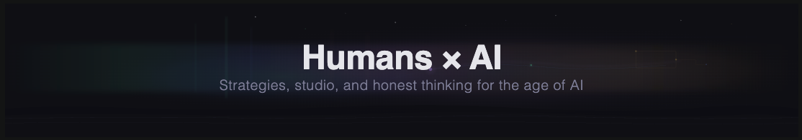

  

  <strong>We're not AI optimists or AI pessimists. We're AI realists.</strong>

  <a href="https://www.kynetyk.ai">Website</a> ·
  <a href="https://www.kynetyk.ai/writing/">Writing</a> ·
  <a href="https://www.kynetyk.ai/studio/">Studio</a> ·
  <a href="https://www.kynetyk.ai/services/">Services</a> ·
  <a href="https://buttondown.com/kynetyk">Newsletter</a>

---

## What we do

We write about what's actually happening in AI, build products that put humans and AI on the same team, and help companies figure out how to make AI genuinely useful.

The name comes from *kinetic* — the energy of things in motion. We believe AI is most valuable when it's moving alongside people, not replacing them or operating in isolation.

---

## Studio

<table>
<tr>
<td width="50%" valign="top">

### [House Rules](https://house-rules.app)

**Tabletop games for humans, friends, and AI.**

A free-form game platform where your group can play together via the web. Bring your own rules.

`BETA · PLAYABLE NOW`

</td>
<td width="50%" valign="top">

### [Jamb for Mac](https://getjamb.app)

**Where your AI co-work goes to live.**

A local-first canvas on your Mac that holds reference material, dashboards, and the things you build with AI. Your AI knows how to build for it — and works in it directly.

`COMING SOON`

</td>
</tr>
</table>

---

## Writing

  
  
  
  

- **Honest Signal** — Consumer Reports–style AI reviews and testing.
- **Ghost in the Machine** — Essays on human–AI collaboration.
- **Waveform** — Products and what we're building.
- **AV Club** — DIY projects for AI enthusiasts.

[Read the latest →](https://www.kynetyk.ai/writing/) &nbsp;·&nbsp; [Subscribe to the newsletter →](https://buttondown.com/kynetyk)

---

## Get in touch

We work directly with companies and founders on AI strategy, development, and hands-on building. **No pitch deck required.**

  
  
  
  

